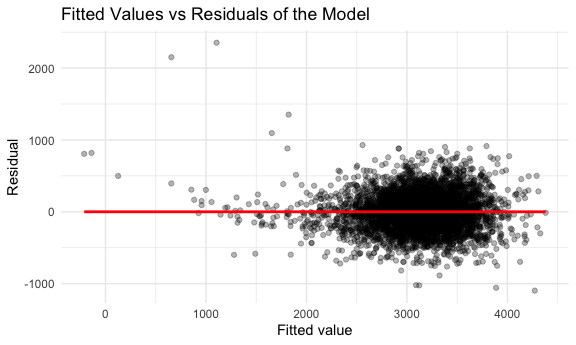
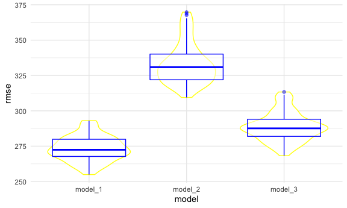

P8105\_hw6\_yw3774
================
Yida Wang
11/24/2021

# Problem 1

### Data cleaning

``` r
birthweight = read_csv("birthweight.csv") %>%
  janitor::clean_names() %>% 
  mutate(
    babysex = ifelse(babysex == 1, "male", "female"),
    babysex = as.factor(babysex),
    frace = factor(recode(frace, `1` = "White", `2` = "Black", `3` = "Asian", `4` = "Puerto Rican", `8` = "Other", `9` = "Unknown")), 
    mrace = factor(recode(mrace, `1` = "White", `2` = "Black", `3` = "Asian", `4` = "Puerto Rican", `8` = "Other")),
    malform = ifelse(malform == 0, "absent", "present"), 
    malform = as.factor(malform)
  )
```

    ## Rows: 4342 Columns: 20

    ## ── Column specification ────────────────────────────────────────────────────────
    ## Delimiter: ","
    ## dbl (20): babysex, bhead, blength, bwt, delwt, fincome, frace, gaweeks, malf...

    ## 
    ## ℹ Use `spec()` to retrieve the full column specification for this data.
    ## ℹ Specify the column types or set `show_col_types = FALSE` to quiet this message.

### Check missing value

``` r
purrr::map(birthweight, ~sum(is.na(.)))
```

    ## $babysex
    ## [1] 0
    ## 
    ## $bhead
    ## [1] 0
    ## 
    ## $blength
    ## [1] 0
    ## 
    ## $bwt
    ## [1] 0
    ## 
    ## $delwt
    ## [1] 0
    ## 
    ## $fincome
    ## [1] 0
    ## 
    ## $frace
    ## [1] 0
    ## 
    ## $gaweeks
    ## [1] 0
    ## 
    ## $malform
    ## [1] 0
    ## 
    ## $menarche
    ## [1] 0
    ## 
    ## $mheight
    ## [1] 0
    ## 
    ## $momage
    ## [1] 0
    ## 
    ## $mrace
    ## [1] 0
    ## 
    ## $parity
    ## [1] 0
    ## 
    ## $pnumlbw
    ## [1] 0
    ## 
    ## $pnumsga
    ## [1] 0
    ## 
    ## $ppbmi
    ## [1] 0
    ## 
    ## $ppwt
    ## [1] 0
    ## 
    ## $smoken
    ## [1] 0
    ## 
    ## $wtgain
    ## [1] 0

### Build the model base on a data-driven model-building process

Step-wise regression

``` r
mult.fit = lm(bwt ~ ., data = birthweight)
step(mult.fit, direction = 'both')
```

    ## Start:  AIC=48717.83
    ## bwt ~ babysex + bhead + blength + delwt + fincome + frace + gaweeks + 
    ##     malform + menarche + mheight + momage + mrace + parity + 
    ##     pnumlbw + pnumsga + ppbmi + ppwt + smoken + wtgain
    ## 
    ## 
    ## Step:  AIC=48717.83
    ## bwt ~ babysex + bhead + blength + delwt + fincome + frace + gaweeks + 
    ##     malform + menarche + mheight + momage + mrace + parity + 
    ##     pnumlbw + pnumsga + ppbmi + ppwt + smoken
    ## 
    ## 
    ## Step:  AIC=48717.83
    ## bwt ~ babysex + bhead + blength + delwt + fincome + frace + gaweeks + 
    ##     malform + menarche + mheight + momage + mrace + parity + 
    ##     pnumlbw + ppbmi + ppwt + smoken
    ## 
    ## 
    ## Step:  AIC=48717.83
    ## bwt ~ babysex + bhead + blength + delwt + fincome + frace + gaweeks + 
    ##     malform + menarche + mheight + momage + mrace + parity + 
    ##     ppbmi + ppwt + smoken
    ## 
    ##            Df Sum of Sq       RSS   AIC
    ## - frace     4    124365 320848704 48712
    ## - malform   1      1419 320725757 48716
    ## - ppbmi     1      6346 320730684 48716
    ## - momage    1     28661 320752999 48716
    ## - mheight   1     66886 320791224 48717
    ## - menarche  1    111679 320836018 48717
    ## - ppwt      1    131132 320855470 48718
    ## <none>                  320724338 48718
    ## - fincome   1    193454 320917792 48718
    ## - parity    1    413584 321137922 48721
    ## - mrace     3    868321 321592659 48724
    ## - babysex   1    853796 321578134 48727
    ## - gaweeks   1   4611823 325336161 48778
    ## - smoken    1   5076393 325800732 48784
    ## - delwt     1   8008891 328733230 48823
    ## - blength   1 102050296 422774634 49915
    ## - bhead     1 106535716 427260054 49961
    ## 
    ## Step:  AIC=48711.51
    ## bwt ~ babysex + bhead + blength + delwt + fincome + gaweeks + 
    ##     malform + menarche + mheight + momage + mrace + parity + 
    ##     ppbmi + ppwt + smoken
    ## 
    ##            Df Sum of Sq       RSS   AIC
    ## - malform   1      1447 320850151 48710
    ## - ppbmi     1      6975 320855679 48710
    ## - momage    1     28379 320877083 48710
    ## - mheight   1     69502 320918206 48710
    ## - menarche  1    115708 320964411 48711
    ## - ppwt      1    133961 320982665 48711
    ## <none>                  320848704 48712
    ## - fincome   1    194405 321043108 48712
    ## - parity    1    414687 321263390 48715
    ## + frace     4    124365 320724338 48718
    ## - babysex   1    852133 321700837 48721
    ## - gaweeks   1   4625208 325473911 48772
    ## - smoken    1   5036389 325885093 48777
    ## - delwt     1   8013099 328861802 48817
    ## - mrace     3  13540415 334389119 48885
    ## - blength   1 101995688 422844392 49908
    ## - bhead     1 106662962 427511666 49956
    ## 
    ## Step:  AIC=48709.53
    ## bwt ~ babysex + bhead + blength + delwt + fincome + gaweeks + 
    ##     menarche + mheight + momage + mrace + parity + ppbmi + ppwt + 
    ##     smoken
    ## 
    ##            Df Sum of Sq       RSS   AIC
    ## - ppbmi     1      6928 320857079 48708
    ## - momage    1     28660 320878811 48708
    ## - mheight   1     69320 320919470 48708
    ## - menarche  1    116027 320966177 48709
    ## - ppwt      1    133894 320984044 48709
    ## <none>                  320850151 48710
    ## - fincome   1    193784 321043934 48710
    ## + malform   1      1447 320848704 48712
    ## - parity    1    414482 321264633 48713
    ## + frace     4    124393 320725757 48716
    ## - babysex   1    851279 321701430 48719
    ## - gaweeks   1   4624003 325474154 48770
    ## - smoken    1   5035195 325885346 48775
    ## - delwt     1   8029079 328879230 48815
    ## - mrace     3  13553320 334403471 48883
    ## - blength   1 102009225 422859375 49906
    ## - bhead     1 106675331 427525481 49954
    ## 
    ## Step:  AIC=48707.63
    ## bwt ~ babysex + bhead + blength + delwt + fincome + gaweeks + 
    ##     menarche + mheight + momage + mrace + parity + ppwt + smoken
    ## 
    ##            Df Sum of Sq       RSS   AIC
    ## - momage    1     29211 320886290 48706
    ## - menarche  1    117635 320974714 48707
    ## <none>                  320857079 48708
    ## - fincome   1    195199 321052278 48708
    ## + ppbmi     1      6928 320850151 48710
    ## + malform   1      1400 320855679 48710
    ## - parity    1    412984 321270064 48711
    ## + frace     4    125020 320732060 48714
    ## - babysex   1    850020 321707099 48717
    ## - mheight   1   1078673 321935752 48720
    ## - ppwt      1   2934023 323791103 48745
    ## - gaweeks   1   4621504 325478583 48768
    ## - smoken    1   5039368 325896447 48773
    ## - delwt     1   8024939 328882018 48813
    ## - mrace     3  13551444 334408523 48881
    ## - blength   1 102018559 422875638 49904
    ## - bhead     1 106821342 427678421 49953
    ## 
    ## Step:  AIC=48706.02
    ## bwt ~ babysex + bhead + blength + delwt + fincome + gaweeks + 
    ##     menarche + mheight + mrace + parity + ppwt + smoken
    ## 
    ##            Df Sum of Sq       RSS   AIC
    ## - menarche  1    100121 320986412 48705
    ## <none>                  320886290 48706
    ## - fincome   1    240800 321127090 48707
    ## + momage    1     29211 320857079 48708
    ## + ppbmi     1      7479 320878811 48708
    ## + malform   1      1678 320884612 48708
    ## - parity    1    431433 321317724 48710
    ## + frace     4    124743 320761547 48712
    ## - babysex   1    841278 321727568 48715
    ## - mheight   1   1076739 321963029 48719
    ## - ppwt      1   2913653 323799943 48743
    ## - gaweeks   1   4676469 325562760 48767
    ## - smoken    1   5045104 325931394 48772
    ## - delwt     1   8000672 328886962 48811
    ## - mrace     3  14667730 335554021 48894
    ## - blength   1 101990556 422876847 49902
    ## - bhead     1 106864308 427750598 49952
    ## 
    ## Step:  AIC=48705.38
    ## bwt ~ babysex + bhead + blength + delwt + fincome + gaweeks + 
    ##     mheight + mrace + parity + ppwt + smoken
    ## 
    ##            Df Sum of Sq       RSS   AIC
    ## <none>                  320986412 48705
    ## + menarche  1    100121 320886290 48706
    ## - fincome   1    245637 321232048 48707
    ## + momage    1     11698 320974714 48707
    ## + ppbmi     1      8823 320977589 48707
    ## + malform   1      1884 320984528 48707
    ## - parity    1    422770 321409181 48709
    ## + frace     4    128726 320857686 48712
    ## - babysex   1    846134 321832545 48715
    ## - mheight   1   1012240 321998651 48717
    ## - ppwt      1   2907049 323893461 48743
    ## - gaweeks   1   4662501 325648912 48766
    ## - smoken    1   5073849 326060260 48771
    ## - delwt     1   8137459 329123871 48812
    ## - mrace     3  14683609 335670021 48894
    ## - blength   1 102191779 423178191 49903
    ## - bhead     1 106779754 427766166 49950

    ## 
    ## Call:
    ## lm(formula = bwt ~ babysex + bhead + blength + delwt + fincome + 
    ##     gaweeks + mheight + mrace + parity + ppwt + smoken, data = birthweight)
    ## 
    ## Coefficients:
    ##       (Intercept)        babysexmale              bhead            blength  
    ##         -6145.151            -28.558            130.777             74.947  
    ##             delwt            fincome            gaweeks            mheight  
    ##             4.107              0.318             11.592              6.594  
    ##        mraceBlack  mracePuerto Rican         mraceWhite             parity  
    ##           -63.906            -25.791             74.887             96.305  
    ##              ppwt             smoken  
    ##            -2.676             -4.843

According to the result calculating above, the regression model of
birthweight contains babysexmale, bhead, blength, delwt, fincome,
gaweeks, mheight, mraceBlack, mracePuerto Rican, mraceWhite, parity,
ppwt, smoken.

``` r
model_1 = lm(bwt ~ babysex + bhead + blength + delwt + fincome + gaweeks + mheight + mrace + parity + ppwt + smoken, data = birthweight)
```

### Residuals plot

``` r
birthweight %>% 
  add_predictions(model_1) %>% 
  add_residuals(model_1) %>% 
  ggplot(aes(x = pred, y = resid)) +
  geom_point(alpha = 0.3) + 
  geom_smooth(se = F, color = "red", method = "lm") +
  labs(title = "Fitted Values vs Residuals of the Model",
       x = "Fitted value", 
       y = "Residual")
```

    ## `geom_smooth()` using formula 'y ~ x'


It shows that most of the points are symmetrically distributed and
clustered around 0 on the y-axis.

### Other two models

Using length at birth and gestational age as predictors (main effects
only)

``` r
model_2 = lm(bwt ~ blength + gaweeks, data = birthweight)
```

Using head circumference, length, sex, and all interactions (including
the three-way interaction) between these

``` r
model_3 = lm(bwt ~ bhead + blength + babysex + bhead * blength + bhead * babysex + blength * babysex + bhead * blength * babysex, data = birthweight)
```

### Comparison

Make comparison in terms of the cross-validated prediction error between
the models

``` r
cv = crossv_mc(birthweight, 100) %>% 
  mutate(
    model_1 = map(train, ~lm(bwt ~ babysex + bhead + blength + delwt + fincome + gaweeks + mheight + mrace + parity + ppwt + smoken, data = .x)),
    model_2 = map(train, ~lm(bwt ~ blength + gaweeks, data = .x)),
    model_3 = map(train, ~lm(bwt ~ bhead + blength + babysex + 
               bhead * blength + bhead * babysex + blength * babysex + 
               bhead * blength * babysex, data = .x))) %>% 
  mutate(
    rmse_model_1 = map2_dbl(model_1, test, ~rmse(model = .x, data = .y)),
    rmse_model_2 = map2_dbl(model_2, test, ~rmse(model = .x, data = .y)),
    rmse_model_3 = map2_dbl(model_3, test, ~rmse(model = .x, data = .y))
    )
```

### The plot for RMSE

``` r
cv %>% 
  select(starts_with("rmse")) %>% 
  pivot_longer(
    everything(),
    names_to = "model", 
    values_to = "rmse",
    names_prefix = "rmse_") %>% 
  mutate(model = fct_inorder(model)) %>% 
  ggplot(aes(x = model, y = rmse)) + 
  geom_violin(color = "yellow") + 
  geom_boxplot(alpha = 0.5, color = "blue")
```


Base on the plot above, we can draw a conclusion that model 1 has the
lowest RMSE, which means it is the best fitted model. The model 2 has
the highest RMSE with the fewest predictors which performs the worst.

# Problem 2

``` r
weather_df = 
  rnoaa::meteo_pull_monitors(
    c("USW00094728"),
    var = c("PRCP", "TMIN", "TMAX"), 
    date_min = "2017-01-01",
    date_max = "2017-12-31") %>%
  mutate(
    name = recode(id, USW00094728 = "CentralPark_NY"),
    tmin = tmin / 10,
    tmax = tmax / 10) %>%
  select(name, id, everything())
```

    ## Registered S3 method overwritten by 'hoardr':
    ##   method           from
    ##   print.cache_info httr

    ## using cached file: ~/Library/Caches/R/noaa_ghcnd/USW00094728.dly

    ## date created (size, mb): 2021-10-05 10:31:28 (7.602)

    ## file min/max dates: 1869-01-01 / 2021-10-31

### Bookstrapping

``` r
boot_sample = function(df) {
  sample_frac(df, size = 1, replace = TRUE)
}

bootstrap_df = 
  tibble(
    strap_number = c(1:5000),
    strap_sample = rerun(5000, boot_sample(weather_df))
  )

weather_strap_results = bootstrap_df %>% 
  mutate(
    models = map(strap_sample, ~lm(tmax ~ tmin, data = .x)),
    results = map(models, broom::glance)
  )
```

### Adjusted R squared

``` r
adj_r2 = 
  weather_strap_results %>%
  select(strap_number, results) %>% 
  unnest(results) %>% 
  select(strap_number, adj.r.squared)
  
  
adj_r2 %>%
  ggplot(aes(x = adj.r.squared)) +
  geom_density() +
  labs(
        title = "Distribution of R Squared",
        x = "Estimated R Squared") +
  theme(plot.title = element_text(hjust = 0.5))
```


``` r
quantile(adj_r2 %>% pull(adj.r.squared), prob = c(0.025, 0.975))
```

    ##      2.5%     97.5% 
    ## 0.8942232 0.9270922

The R-squared values by using bootstraping approximately follows a
normal distribution with mean a little higher than 0.91, and the 95%
confidence interval is \[0.894, 0.927\].

### Estimated log(beta0\_hat \* beta1\_hat)

``` r
log = 
  bootstrap_df %>% 
  mutate(
    models = map(.x = strap_sample, ~lm(tmax ~ tmin, data = .x)),
    results = map(models, broom::tidy)
  ) %>% 
  select(strap_number, results) %>% 
  unnest(results) %>% 
  select(strap_number, term, estimate) %>% 
  pivot_wider(names_from = term, 
              values_from = estimate) %>% 
  janitor::clean_names() %>% 
  mutate(log = log(intercept * tmin))


log %>% 
  ggplot(aes(x = log)) +
  geom_density() +
  labs(
        title = "Distribution of Log(beta0_hat * beta1_hat)",
        x = "Estimated (beta0_hat * beta1_hat)")
```


``` r
quantile(log %>% pull(log), prob = c(0.025, 0.975))
```

    ##     2.5%    97.5% 
    ## 1.963259 2.059234

The values of log(beta0\_hat \* beta1\_hat) by using bootstraping are
approximately normally distributed with a mean around 2.02, and has a
slightly longer tail on the left. The 95% confidence interval is
\[1.966, 2.059\].
